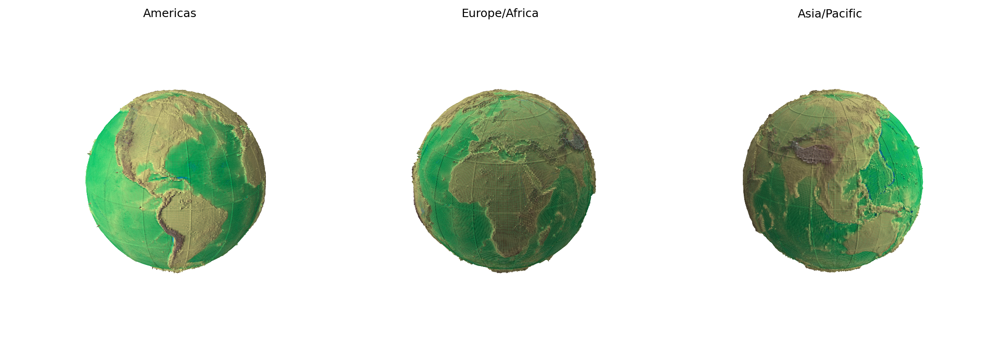

# 20-inch tactile Earth globe

Print-ready northern and southern hemispheres of a **20 inch (508 mm)**
Earth globe. Terrain is real [NOAA ETOPO 2022](https://www.ncei.noaa.gov/products/etopo-global-relief-model)
bed elevation, not a stylized texture. Latitude/longitude ribs are
raised on the surface.



## Download the two STLs

These files are ~200 MB each, so they live on GitHub Releases rather
than in the git tree.

**[Download the latest release](https://github.com/sankalpsthakur/20-inch-earth-globe/releases/latest)**

| File | Size | What it is |
|---|---:|---|
| [`globe_grid_20in_NORTH_hemisphere_mm.stl`](https://github.com/sankalpsthakur/20-inch-earth-globe/releases/latest) | 200 MB | Northern hemisphere |
| [`globe_grid_20in_SOUTH_hemisphere_mm.stl`](https://github.com/sankalpsthakur/20-inch-earth-globe/releases/latest) | 196 MB | Southern hemisphere |

```bash
# after you drop both files into stl/
shasum -a 256 -c stl/SHA256SUMS
```

Units are **millimeters**. Tell the slicer that. Do not scale unless
you want a smaller globe.

Full print settings, hollowing, orientation, glue-up, and paint notes:
**[PRINTING.md](PRINTING.md)**.

## Why two files

A 20-inch sphere does not fit a desktop printer, and a solid ball at
this size is ~62 liters of plastic. The master mesh is split at the
equator into two open hemispherical shells:

- Each half is ~508 mm across and ~254 mm tall
- Polar axis is **Y-up** (north = +Y)
- Print **equator-down**, pole up
- You need a bed of at least **510 × 510 × 260 mm** for a full-size print

On a 256 mm machine, scale to 50% (10 inch globe) or regenerate a
12-inch mesh with the script below.

## What is in the mesh

The released halves are a partition of the high-resolution master
(`2,880 × 1,440` cells, 8,294,400 triangles). Report:
[`docs/reports/20in-master-report.json`](docs/reports/20in-master-report.json).

| | Value |
|---|---|
| Target diameter | 20 in / 508 mm |
| Source | NOAA ETOPO 2022, 60-arc-second bed, EGM2008 |
| Land / water | cell average |
| Mountains | cell maximum (narrow ranges kept) |
| Trenches | cell minimum (narrow trenches kept) |
| Everest relief | +13.5 mm |
| Challenger Deep relief | −11 mm |
| Grid | 15° minor (0.7 mm), 30° major (1.6 mm) |
| Equator spacing | ~0.55 mm |
| Watertight master | yes, Euler characteristic 2 |

Relief is exaggerated so mountain ranges and trenches are tactile. It is
not a 1:1 scale model of Earth's hypsometry.

A slightly softer 20-inch variant (8.2 mm / −6.6 mm relief, 2,160 × 1,080)
is documented in [`docs/reports/20in-extreme-report.json`](docs/reports/20in-extreme-report.json).
The two Release STLs are the **master** split, not that variant.

## Regenerate or resize

You need Python 3.11+, `numpy`, `matplotlib`, plus `gdalwarp` and
`aria2c` on `PATH` if the NOAA NetCDF is not already cached.

```bash
python3 -m venv .venv
source .venv/bin/activate
pip install -r requirements.txt

# 20-inch high-res master (the mesh these hemispheres came from)
python scripts/make_etopo_relief_globe_stl.py \
  --diameter-inches 20 \
  --lon-segments 2880 \
  --mountain-relief-mm 13.5 \
  --trench-relief-mm 11.0 \
  --minor-grid-mm 0.7 \
  --major-grid-mm 1.6 \
  --output-prefix globe_grid_20in_etopo_relief_proper_master

# 12-inch home-printer globe
python scripts/make_etopo_relief_globe_stl.py \
  --diameter-inches 12 \
  --lon-segments 2160
```

The generator writes a Z-up closed mesh (geographic north = +Z) and a
JSON validation report. The released hemisphere files were then split at
the equator and rotated so **Y is up**.

To split a generated full globe and cap the cut:

```bash
python scripts/split_and_cap_hemispheres.py generated/your_globe_mm.stl
```

## License

- Code and DIY docs: [MIT](LICENSE)
- Terrain: NOAA ETOPO 2022, U.S. public domain
- You can print, sell, remix, and republish the meshes. Credit NOAA for
  the elevation and this repo for the processing if you want to be kind.

## Credits

Globe generation and the 20-inch split live next to a pile of other
experiments in a private workspace. This repository is the public,
print-only extract: two STLs, the generator, and the notes you need to
make a globe that you can hold.
